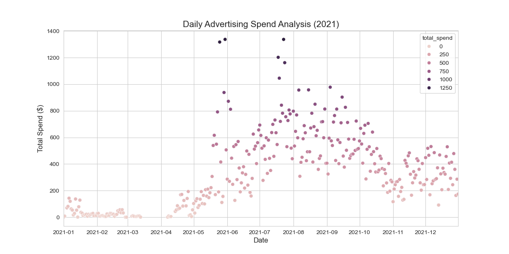
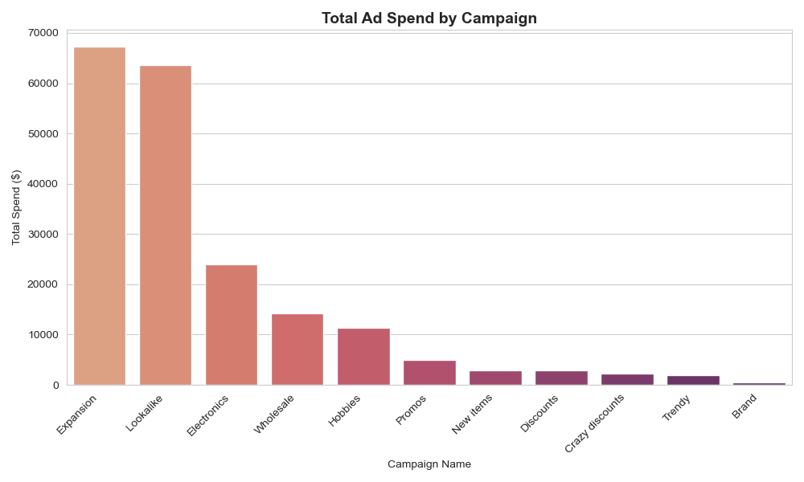
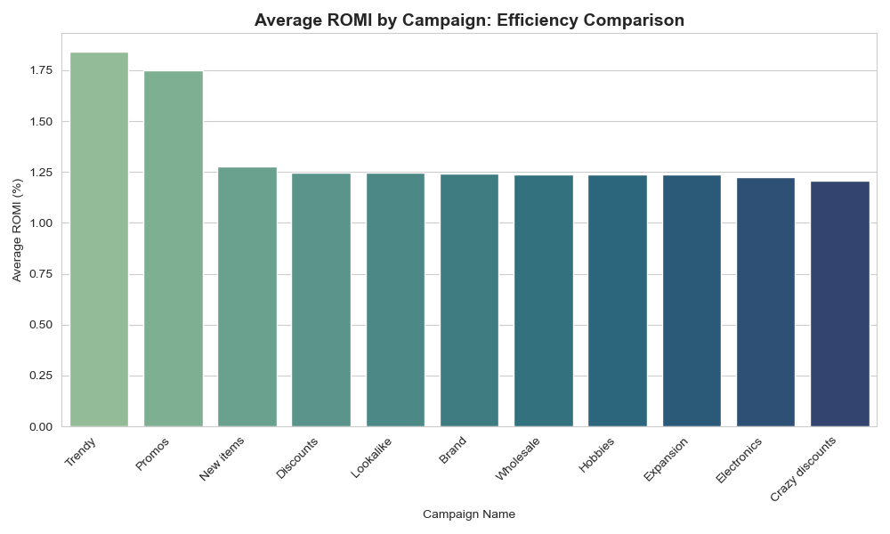
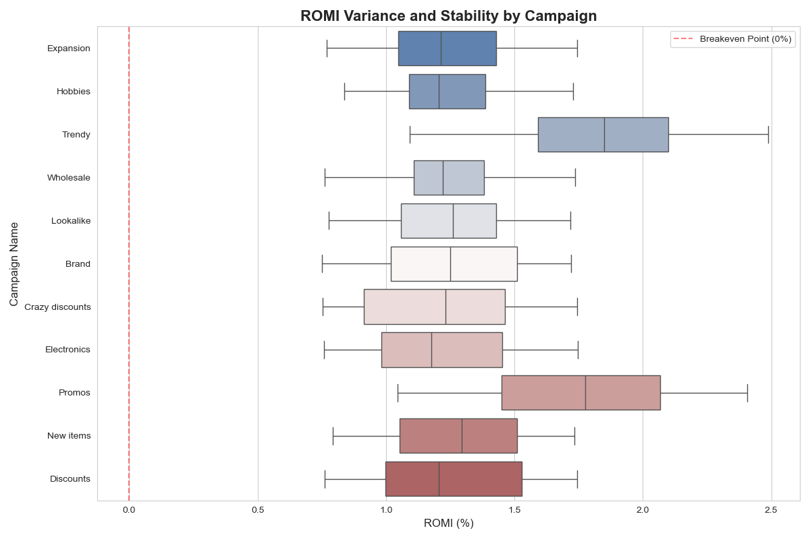
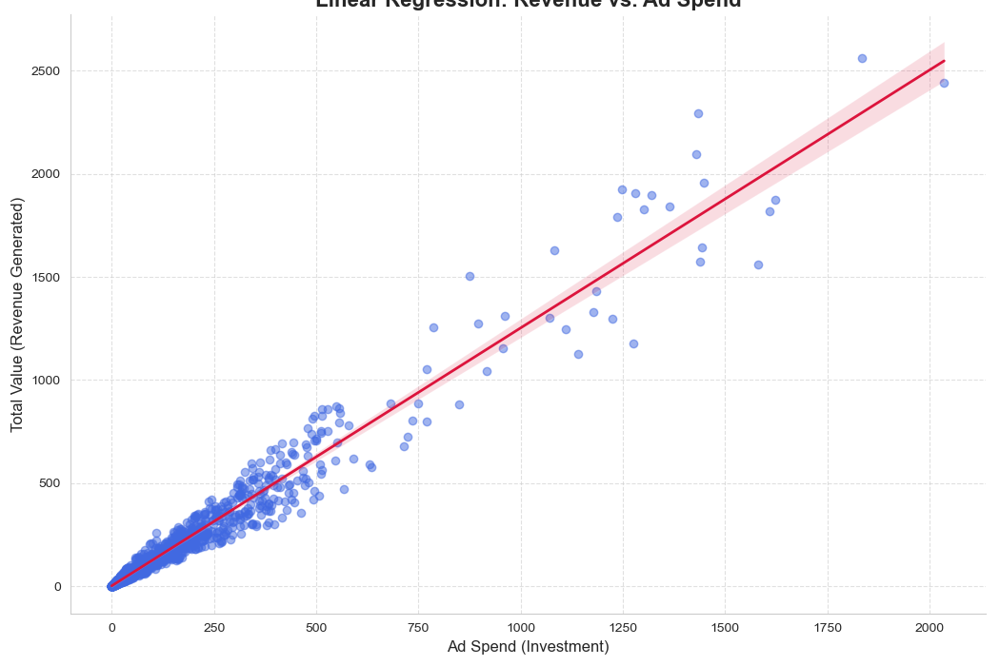

# Facebook Ads Performance Analysis (2021 Case Study)
## 📌 Project Overview
This project focuses on a comprehensive Exploratory Data Analysis (EDA) of Facebook advertising campaigns for the year 2021. 
The goal was to transform raw marketing data into actionable insights regarding budget efficiency, campaign stability, and ROI optimization.

## 🛠 Tech Stack
**Language:** Python
**Libraries:** Pandas, NumPy, Seaborn, Matplotlib
**Environment:** Jupiter Notebook
**Analytic Techniques:** Aggregation, Distribution analysis, Linear Regression, Outlier detection.

## 📊 Key Analysis Stages
### 1. Daily Ad Spend Trends 
I performed data type conversion to datetime and filtered the dataset for the year 2021, aggregated marketing spend on a daily basis to identify investment patterns.
Business Insight:
This visualization helps identify spending volatility and seasonal peaks.
By monitoring daily spend, we can correlate sudden spikes with specific marketing campaigns or external events (e.g., holidays or sales).
### 2. Spending Trends & Smoothing 
To understand the dynamics of advertising spend, I implemented a 7-day rolling average.
This helped filter out daily "noise" and identify clear seasonal peaks in marketing activity, allowing for better budget planning.
Business Insight:
Throughout 2021, the ROMI remained consistently positive, indicating that all advertising efforts effectively generated revenue exceeding the ad spend.
Even during periods of high spending volatility, the rolling average stayed well above the breakeven point, demonstrating a robust and profitable marketing strategy.
### 3. Campaign Budget Allocation 
I aggregated the total advertising expenditure across different marketing campaigns using groupby.
Than I visualized the budget distribution to identify the primary drivers of marketing costs.
Business Insight:
This bar chart clearly shows which campaigns are the top budget consumers.
### 4. Campaign Efficiency (Mean ROMI) 
I used the .groupby() method combined with .mean() to calculate the Average ROMI instead of the total sum to ensure a fair evaluation of efficiency.
Applied .sort_values() to rank campaigns from most to least efficient.
Business Insight:
This visualization shows which marketing channels deliver the highest return for every dollar spent.
Campaigns with high average ROMI but lower total spend (identified in previous steps) are prime candidates for budget scaling
Campaigns with below-average ROMI require further investigation into creative quality or audience targeting to improve overall account health.
### 5. Variance & Risk (Boxplot Analysis) 
Using Boxplots, I analyzed the stability of different campaign types.
Business Insight:
Promos: High ROMI spikes correlate with limited-time offers. This indicates a high price sensitivity of the audience—they respond aggressively to discounts.
Trendy: The high volatility reflects the short lifecycle of viral products. These campaigns drive exceptional returns during the peak of interest but require constant monitoring to avoid overspending when the trend fades.
Risk Management: By looking at the "whiskers" relative to the Breakeven Point (0%), we can see which campaigns are at risk of falling into negative ROI.
### 6. Correlation: Spend vs. Revenue 
I applied a Linear Regression model (lmplot) to visualize the relationship between investment and return.
Business Insight:
The slope of the red line shows the efficiency of our spending. A steep upward slope indicates that increasing the budget effectively drives more revenue.
The closer the blue dots (actual data) are to the red line, the more predictable our marketing results are.
If we saw the dots "fanning out" at higher spend levels, it would suggest that simply throwing more money at ads becomes less effective over time. In this dataset, we can identify the optimal spending range where the return is most consistent.

## 🚀 Final Conclusions & Recommendations
Scale "Trendy" Campaigns: Since these show explosive ROMI spikes, they should receive aggressive, short-term budget increases during peak interest.
Optimize Baseline Spend: Campaigns with narrow boxes (low volatility) should serve as the "safe" foundation for the marketing budget.

Budget Reallocation: By shifting funds from low-performing/high-cost segments to those with a higher Average ROMI, we can increase the overall account profitability without increasing total spend.
